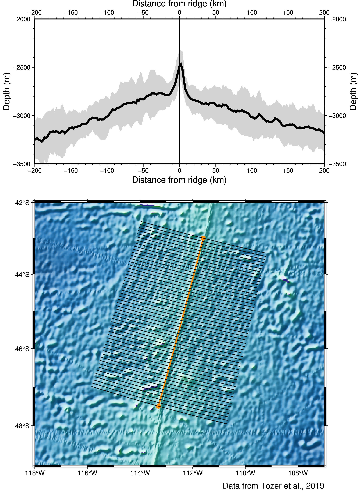
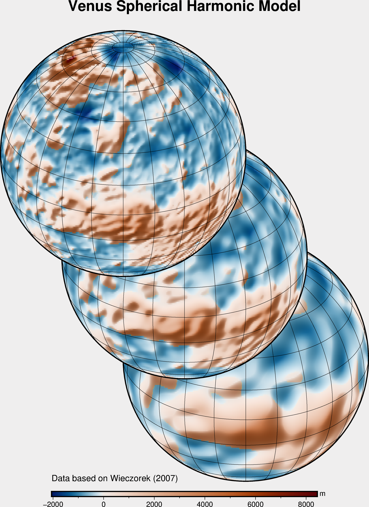
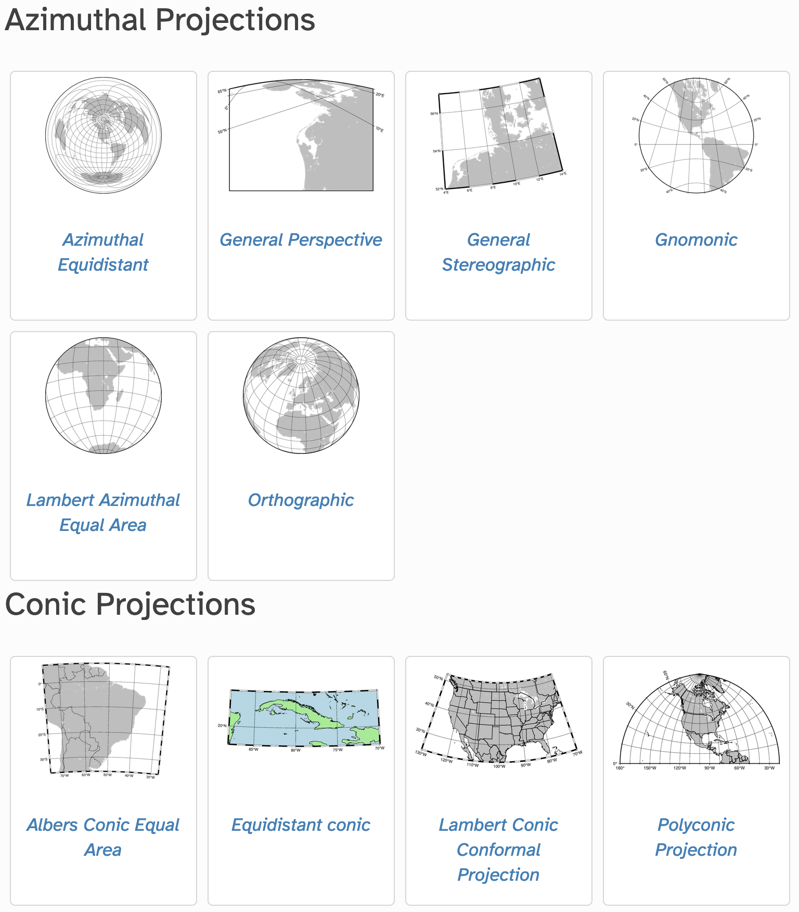
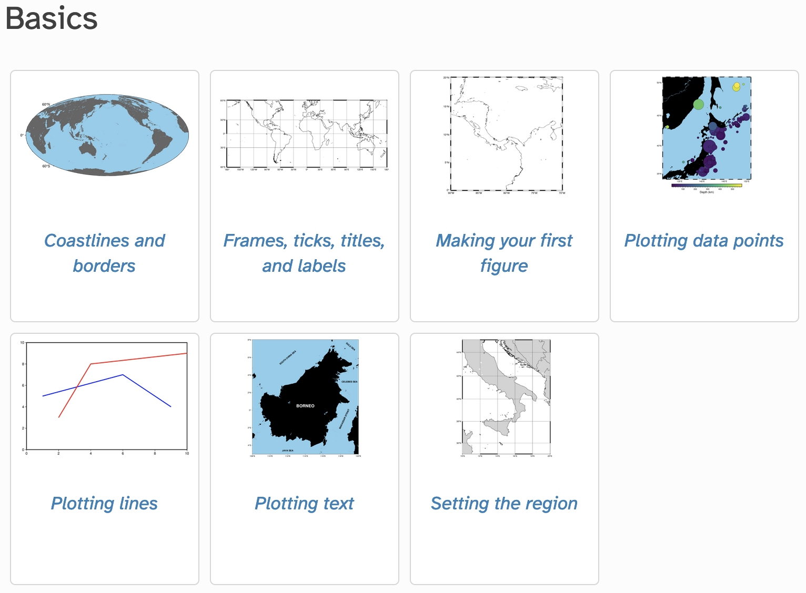
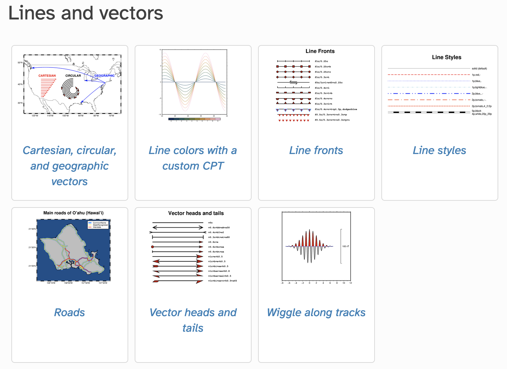
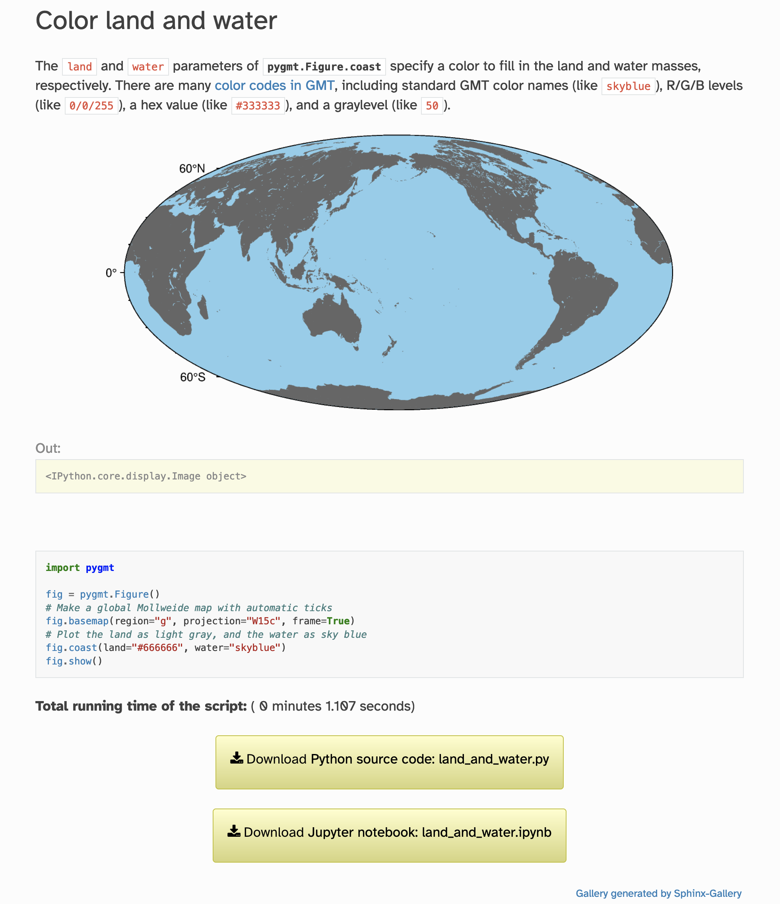
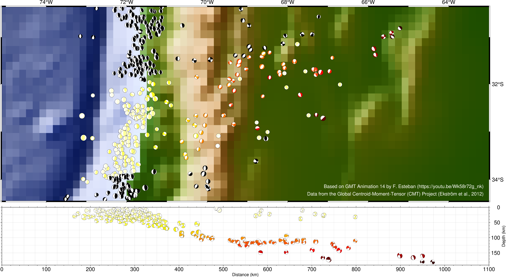

# PyGMT: An open-source Python library for geospatial processing, analysis, and visualization

 Meghan Jones, Michael Grund, Will Schlitzer, Wei Ji Leong, Dongdong Tian, Jiayuan Yao, and Leonardo Uieda

## Overview

What is PyGMT?

- [Open-source](https://github.com/GenericMappingTools/pygmt) Python package
- Geospatial processing/plotting toolbox

Why use PyGMT?

- Process, analyze, and plot Cartesian, geographic, and/or time-series data
- Work with NumPy, pandas, xarray, and GeoPandas objects
- Display analysis and visualizations in Jupyter Notebooks
- Interact with a [supportive community](https://forum.generic-mapping-tools.org/) of geospatial enthusiasts

## Processing tables|grids

[Processing documentation](https://www.pygmt.org/latest/api/index.html#data-processing)

### Examples

- Grid arbitrarily spaced data
- Project data onto lines or great circles
- Clip, cut, fill, and sample grids
- Filter grids in the space or time domains

**Stacking automatically generated cross-profiles**

**Evaluation of spherical harmonics coefficients**

## Data visualization

[Plotting documentation](https://www.pygmt.org/latest/api/index.html#plotting)

### Examples

- Project and plot grids or images
- Create 3-D perspective images
- Plot velocity vectors, crosses, anisotropy bars, and wedges
- Plot focal mechanisms

## Cross-package integration

### Examples

- Process and plot NumPy, pandas, xarray, and GeoPandas objects
- Receive xarray.DataArray objects with metadata as raster products
- Display PyGMT figures and processing results in Jupyter notebooks

### Future plans

- Improved output options for tabular datasets
- Improved integration with ObsPy Trace and Stream objects
- Improved GeoTiff support through integration with rioxarray

## Learning PyGMT

### Introduction to PyGMT YouTube tutorial

### Tutorials for learning concepts

### Gallery examples for specific tasks

### Getting help

Ask any questions about PyGMT usage on the [Forum Q&A](https://forum.generic-mapping-tools.org/c/questions/pygmt-q-a/)!

## Contributing to PyGMT

All are welcome to contribute to PyGMT! Here are some resources for getting started and please reach out with any questions!

- [Community code of conduct](https://github.com/GenericMappingTools/pygmt/blob/main/CODE_OF_CONDUCT.md)
- [Guide for PyGMT Contributors](https://www.pygmt.org/latest/contributing.html)
- [Discourse Forum](https://forum.generic-mapping-tools.org/c/questions/pygmt-q-a/11) Q&A
- Instructions for submitting [feature requests](https://www.pygmt.org/latest/contributing.html#submitting-a-feature-request), [bug reports](https://www.pygmt.org/latest/contributing.html#reporting-a-bug), or [general feedback](https://www.pygmt.org/latest/contributing.html#submitting-general-comments-questions)!

Spread the word, star the project on GitHub, and cite PyGMT when appropriate!

## Gallery slideshow

